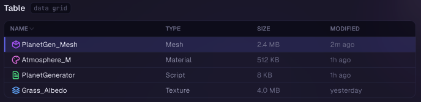
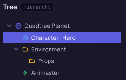
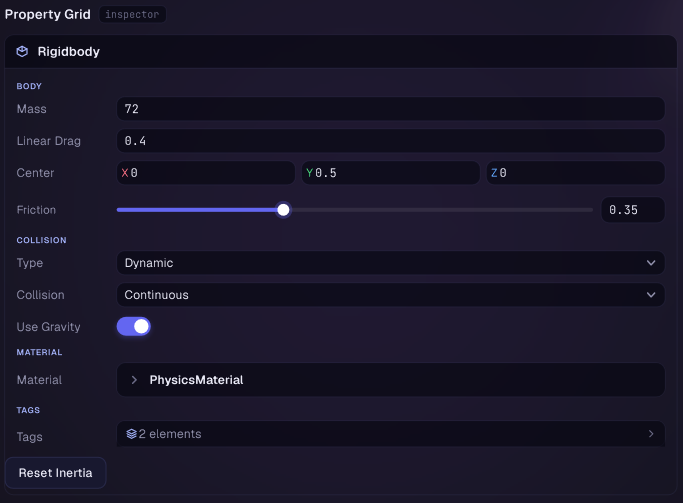
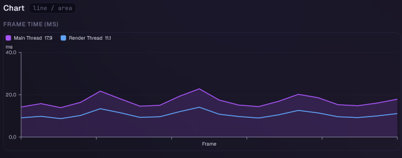
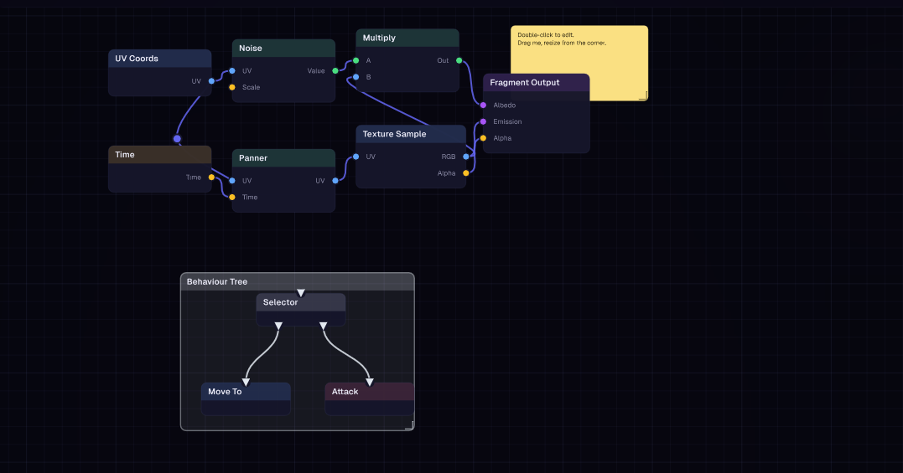
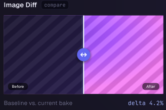

# Data Display

Widgets for showing structured or tabular data: tables, trees, property grids, charts, flame graphs, node graphs and image comparisons.

## Table

A bordered data grid with typed columns, sortable headers, selection, and optional fixed-height virtualized scrolling for long lists.



```csharp
Origami.Table(paper, "assets-table", selectedRow, i => selectedRow = i)
    .Column("Name", flex: 2f, sortable: true)
    .Column("Type", flex: 1f)
    .Column("Size", flex: 1f, align: TextAlignment.MiddleRight)
    .Row().Cell("Player.cs", ink).Cell("Script", ink).CellRight("4.2 KB", ink)
    .Row().Cell("Texture.png", ink).Cell("Image", ink).CellRight("512 KB", ink)
    .Show();
```

- `Scroll(width, height)` fixes the table size with an internal scrolling body (header stays pinned); add `.Virtualize()` for long lists so only visible rows are laid out
- `Sort(activeColumn, ascending, onSortColumn)` wires a directional caret and click-to-sort on sortable columns
- `MultiSelect()` + `IsSelected(...)` + `OnSelectModified(...)` for ctrl/shift multi-row selection instead of the default single `selectedIndex`
- `OnRowActivate(...)` / `OnRowContext(...)` for double-click and right-click row actions
- `CellContent(draw)` + `RowCount(n)` replace `.Row().Cell(...)` data with fully custom per-cell drawing (badges, inline editors, etc.)

Notes: `Virtualize()` requires `Scroll(...)` to be set first, since it needs a fixed viewport to compute the visible row range.

## Tree

A virtualized hierarchical list with expand/collapse, checkboxes, drag-drop, rename, and context menus. Nodes are supplied as a flat, depth-first list; the widget manages expand state internally.



```csharp
var nodes = new List<TreeNode>
{
    new() { Id = "root", Label = "Scene", Depth = 0, HasChildren = true, DefaultExpanded = true },
    new() { Id = "cam",  Label = "Main Camera", Depth = 1, IsLeaf = true },
    new() { Id = "player", Label = "Player", Depth = 1, IsLeaf = true },
};

Origami.Tree(paper, "hierarchy", 260, 400)
    .Nodes(nodes)
    .IsSelected(n => n.Id == selectedId)
    .OnSelect(e => selectedId = e.Node.Id)
    .Show();
```

- `Checkboxes()`, `MultiSelect()`, `Reorderable()` toggle common tree features
- `OnExpandChanged(...)` for lazy-loading children when a node opens
- `CanDrag(...)` / `OnDragStart(...)` / `CanDrop(...)` / `OnDrop(...)` for drag-and-drop reparenting
- `OnRenamed(...)` commits an inline rename (set `node.IsRenaming = true` to enter rename mode)
- `CustomRowContent(...)` overrides row content entirely while the tree still draws the caret and checkbox

Notes: children of a collapsed parent must be omitted from the `Nodes` list by the caller — the tree does not filter them out itself.

## PropertyGrid

Reflection-driven field editor for plain objects, similar to a Unity/Godot inspector. Renders one row per serializable field, recursing into nested objects, lists, and enums, with pluggable per-type field drawers.



```csharp
var config = new PropertyGridConfig();
config.Drawers.Register<Color>(new ColorFieldDrawer());

Origami.PropertyGrid(paper, "inspector", selectedObject, config)
    .OnChanged(obj => MarkDirty(obj))
    .Show();
```

- Pass an `IReadOnlyList<object>` instead of a single target to edit a multi-selection; fields that differ across targets are flagged as mixed and edits apply to all
- `PropertyGridConfig.Drawers` registers `FieldDrawer`s per type; `Handlers` registers `AttributeHandler`s per attribute (e.g. `[Range]`, `[Header]`); `CustomEditors` replaces whole nested-object rendering
- `ExpandByDefault(true)` starts nested objects and list entries open instead of collapsed
- `Overrides(HashSet<string>)` highlights prefab-style field overrides with an accent dot

Notes: fields are discovered via reflection (public fields, or private fields tagged `[SerializeField]`); a field's type needs a registered `FieldDrawer`, a custom editor, or its own serializable fields to render as anything other than a read-only "(unsupported)" note.

## Chart

A data-agnostic multi-series line chart with its own axes, ticks, and legend. Owns its full layout so it never overflows its box.



```csharp
Origami.Chart(paper, "fps-chart")
    .Size(400, 200)
    .Series("FPS", Color.LimeGreen, fpsHistory, fill: true)
    .Series("Frame Time (ms)", Color.OrangeRed, frameTimeHistory)
    .YRange(0, 144)
    .Legend()
    .Axes()
    .Show();
```

- `Series(ChartSeries)` accepts a pre-built series (label, color, values, fill) for reuse across frames
- `YRange(min, max)` / `IncludeZero()` / `MinSpan(span)` control the y-axis scale
- `ValueFormatter(...)` / `XTickFormatter(...)` customize axis label text
- `Variant(OrigamiVariant)` (or `.Primary()`, `.Success()`, etc.) tints the default single-series color

## FlameGraph

A generic flame graph for visualizing hierarchical timed spans (profiler traces, call stacks). Supports zoom and pan over the time axis.


```csharp
var root = new FlameNode("Frame", start: 0, duration: 16.6)
{
    Children =
    {
        new FlameNode("Update", 0, 6.0),
        new FlameNode("Render", 6.0, 10.6),
    }
};

Origami.FlameGraph(paper, "profiler")
    .Size(600, 240)
    .Root(root)
    .ValueFormatter(ms => $"{ms:0.00} ms")
    .Zoomable()
    .Pannable()
    .Show();
```

- `Roots(IReadOnlyList<FlameNode>)` accepts multiple top-level spans (e.g. one per thread) instead of a single `Root`
- `ColorFunction((node, depth) => color)` overrides the default per-depth palette
- `RowHeight(px)` controls the height of each stack frame row

## NodeGraph

A pannable, zoomable node-based graph editor. Nodes are real Paper elements (so text stays crisp at any zoom); wires, the grid, and port dots are drawn on the canvas from the same transform, keeping wire endpoints frame-perfect against the nodes.



```csharp
var nodes = new List<GraphNode>
{
    new() { Id = "a", Title = "Input", Position = new Float2(0, 0), Outputs = { new GraphPort("out", "Value") } },
    new() { Id = "b", Title = "Output", Position = new Float2(220, 0), Inputs = { new GraphPort("in", "Value") } },
};
var connections = new List<GraphConnection> { new("a", "out", "b", "in") };

Origami.NodeGraph(paper, "graph", 800, 500)
    .Nodes(nodes)
    .Connections(connections)
    .OnConnect(req => connections.Add(new GraphConnection(req.FromNode, req.FromPort, req.ToNode, req.ToPort)))
    .OnSelectionChanged(sel => selection = sel)
    .Show();
```

- `Groups(...)` / `Stickies(...)` add resizable backdrop groups and sticky notes to the canvas
- `Controller(new NodeGraphController())` gives programmatic control over pan/zoom/selection (`FrameAll()`, `CenterOn(...)`, `FocusNode(...)`)
- `OnValidateConnection(...)` rejects invalid wire connections before `OnConnect` fires
- `OnNodesMoved(...)`, `OnDeleteSelection(...)`, `OnNodeContext(...)` cover the common edit interactions

Notes: the builder does not mutate your node/connection lists itself (aside from what you do in the callbacks) — `OnConnect`, `OnNodesMoved`, and `OnDeleteSelection` all hand back data for the caller to apply.

## ImageDiff

A before/after image comparison with a draggable vertical split bar.



```csharp
Origami.ImageDiff(paper, "diff", beforeTexture, afterTexture)
    .Height(300)
    .SplitPosition(0.5f)
    .Show();
```

- `SplitPosition(0..1)` sets the initial split; the user can then drag the handle
- `BarWidth(...)` / `HandleSize(...)` adjust the divider's visual size

Notes: the `imageA` / `imageB` parameters are typed `object` so the widget stays host-agnostic — the host's render backend is responsible for resolving them to a drawable texture.
