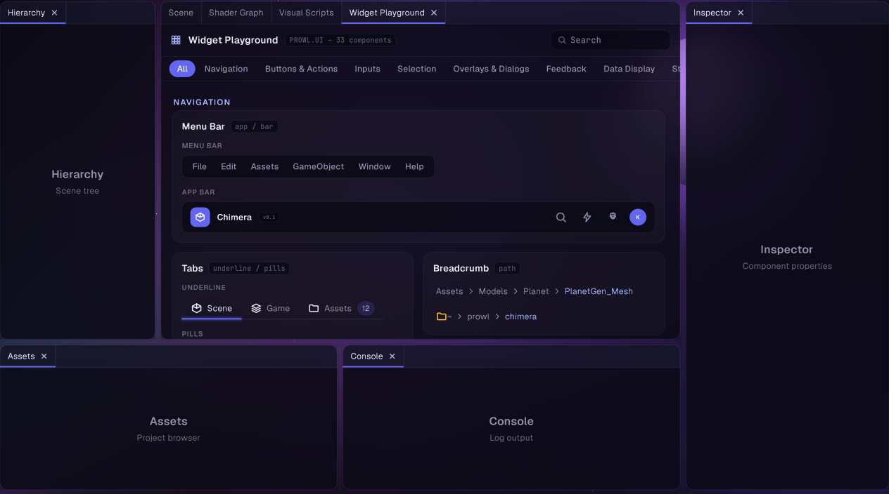
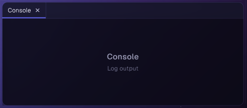
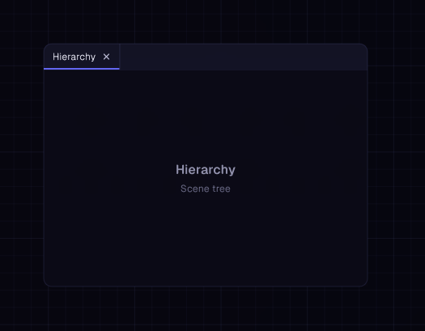

# Docking & Floating Windows

Origami's docking system is a panel-docking layout manager in the style of an IDE's
dockable panels (think Visual Studio or Unity): a tree of splits and tabbed leaves that
fills a root area, plus any number of floating windows that can be dragged out of the
tree and dropped back in. Unlike the rest of the library, it is not exposed through
static `Origami.*` factory methods — you construct a `DockSpace` yourself, hold onto it
for the app's lifetime, and call `Draw` once per frame.

## DockSpace

The root object. Owns the split/tab tree (`Root`) and the list of floating windows, and
drives all drag/drop, splitter, and hover logic. Call `Draw` once per frame with the
screen rect you want the whole dock area to fill.



```csharp
var dockSpace = new DockSpace(
    DockNode.Split(SplitDirection.Horizontal, 0.25f,
        DockNode.Leaf(new SceneTreePanel()),
        DockNode.Split(SplitDirection.Vertical, 0.7f,
            DockNode.Leaf(new ViewportPanel(), new GameViewPanel()),
            DockNode.Leaf(new ConsolePanel()))));

// once per frame
dockSpace.Draw(paper, 0, 0, windowWidth, windowHeight);
```

- `Root` - the root `DockNode` of the split tree; reassign it to swap the whole layout.
- `FloatingWindows` - list of detached `FloatingWindow`s drawn on top of the root tree.
- `TryGetPanelRect(Type, out Rect)` - find the screen rect of the leaf currently hosting
  a panel of the given type (searches all tabs, not just the active one). Only valid
  after `Draw` has run for the frame.

Notes: dragging a tab out of any leaf (root or floating) immediately detaches it into a
new single-tab floating window that follows the cursor; dropping it back onto a leaf's
center re-docks it as a tab, dropping on an edge splits that leaf, and dropping on a
root edge splits the whole tree. Empty leaves left behind by a fully-removed tab are
pruned automatically at the start of the next `Draw`.

## DockNode

The tree node type: either a leaf (holds a list of `DockPanel` tabs) or a split (holds
two children and a direction/ratio). You build the initial tree with the static
factories; `DockSpace` mutates it at runtime as the user drags tabs and splitters.


```csharp
var leaf = DockNode.Leaf(new InspectorPanel());
var split = DockNode.Split(SplitDirection.Horizontal, 0.3f, leaf, DockNode.Leaf(new ViewportPanel()));
```

- `DockNode.Leaf(params DockPanel[] panels)` - a tabbed leaf; `ActiveTabIndex` selects
  which tab is showing.
- `DockNode.Split(SplitDirection dir, float ratio, DockNode a, DockNode b)` - an
  internal split node; `ratio` is child A's share of the space (0..1), user-draggable
  via the splitter handle.
- `IsLeaf` - true when `Tabs != null`.
- `InsertTab` / `RemoveTab` - add or remove a tab from a leaf directly, outside of drag
  interactions (e.g. opening a new panel programmatically).

## DockPanel

The abstract base every dockable panel implements. A panel is a tab: it owns a title,
optional icon, and draws its own content each frame.



```csharp
public class ConsolePanel : DockPanel
{
    public override string Title => "Console";
    public override string Icon => "";

    public override void OnGUI(Paper paper, float width, float height)
    {
        Origami.Label(paper, "console_text", "Hello from the console panel").Show();
    }
}
```

- `Title` / `Icon` - shown in the tab bar; `Icon` is optional (empty string = no icon).
- `IsOpen` - convenience flag for host bookkeeping; the dock system itself doesn't read
  it (closing a tab removes it from the tree directly).
- `OnGUI(Paper, width, height)` - draw the panel's body; called only for the active tab
  in its leaf, sized to the leaf's content area.
- `HeaderWidth` / `OnHeaderContent` - reserve space on the right of the tab bar for
  per-panel controls (e.g. a refresh button), drawn only when this panel's tab is active.
- `SerializeState` / `RestoreState` - persist/restore panel-specific state (see
  Serialization below).
- `OnClosed()` - called once when the user closes this panel's tab (not when it's merely
  dragged elsewhere); override to release resources the panel would otherwise hold for
  the rest of the process.

## FloatingWindow

A detached window that draws on top of the root dock space and can itself be dragged,
resized, and dropped back into the root tree or another floating window.



```csharp
dockSpace.FloatingWindows.Add(
    new FloatingWindow(DockNode.Leaf(new LogPanel()), new Float2(300, 200), new Float2(400, 300)));
```

- `Node` - the `DockNode` this window hosts (leaf or split subtree).
- `Position` / `Size` - screen-space position and size; both are mutated live by drag
  and resize handles.

Notes: floating windows stay single-leaf for docking purposes — dropping a tab onto one
only offers "add as tab" (center), not the edge-split indicators the root tree offers.
Clicking anywhere in a floating window brings it to front (top of the z-order list).

## Serialization

`DockSerializer` converts a `DockSpace` layout to and from a JSON string. It has no file
I/O or project dependencies — the host owns reading/writing the file and reconstructing
panel instances.


```csharp
string json = DockSerializer.Serialize(dockSpace);
File.WriteAllText("layout.json", json);

// later, on load
var floating = new List<FloatingWindow>();
var root = DockSerializer.Deserialize(File.ReadAllText("layout.json"), floating, (typeName, state) =>
{
    DockPanel? panel = typeName switch
    {
        "MyApp.ConsolePanel" => new ConsolePanel(),
        "MyApp.InspectorPanel" => new InspectorPanel(),
        _ => null,
    };
    if (panel != null && state != null) panel.RestoreState(state);
    return panel;
});
if (root != null) dockSpace.Root = root;
dockSpace.FloatingWindows.Clear();
dockSpace.FloatingWindows.AddRange(floating);
```

Notes: panels are stored by their full type name (`Type.GetType().FullName`), so the
`panelFactory` delegate is where you map those names back to instances — there is no
reflection-based auto-construction. Per-panel state round-trips through
`SerializeState`/`RestoreState` as an arbitrary `JsonObject` blob; a panel that returns
`false` (or throws) from `SerializeState` simply has no `state` entry on reload. A leaf
whose panel factory returns `null` for every tab is dropped from the tree entirely.
