# Inputs

Controls the user interacts with directly: buttons, toggles, sliders, fields, and dropdowns.

## Button

A clickable button with label, icon, and loading/disabled states.

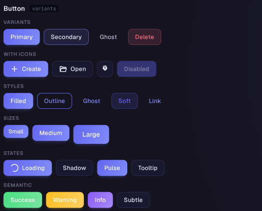

```csharp
Origami.Button(paper, "save-btn", "Save", () => Save())
    .Primary()
    .Show();
```

- `Variant(...)` / `Primary()`, `Success()`, `Warning()`, `Danger()`, `Info()`, `Subtle()`
- `Style(...)` / `Filled()`, `Outline()`, `Ghost()`, `Soft()`, `Link()`
- `Small()`, `Medium()`, `Large()`, `IconOnly()`, `FullWidth()`
- `LeadingIcon(...)`, `TrailingIcon(...)`, `Loading(...)`, `Disabled(...)`
- `Shadow(...)`, `Pulse(...)` for a "primary call to action" accent
- `Origami.IconButton(paper, id, glyphOrIcon, onClick)` is sugar for a square icon-only button

Notes: width auto-sizes from measured label/icon content unless you call `Width(...)` explicitly, because the button paints its chrome via `Canvas.Draw` rather than layout children.

## ButtonGroup

A segmented control where exactly one item is selected.

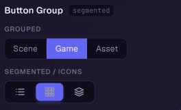

```csharp
Origami.ButtonGroup(paper, "view-mode", selectedIndex, i => selectedIndex = i)
    .Item("List")
    .Item("Grid")
    .Item("Timeline")
    .Show();
```

- `Style(...)` / `Joined()` (shared border, default), `Segmented()` (individual lifted pills)
- `Item(label, leadingIcon?, tooltip?)`, `DisabledItem(...)`
- `Small()`, `Medium()`, `Large()`, `FullWidth()`, `Disabled(...)`

## IconToolbar

A compact row (or column) of square icon-only buttons, e.g. an editor's tool rail.


```csharp
Origami.IconToolbar(paper, "tools", selectedTool, i => selectedTool = i)
    .Item(icons.Move, "Move")
    .Item(icons.Rotate, "Rotate")
    .Item(icons.Scale, "Scale")
    .Show();
```

- `Vertical()` / `Horizontal()`, `Container(bool)` to toggle the glass wrapper
- `Center(...)` (horizontal only), `ButtonSize(...)`

## Toggle

Boolean input rendered as a switch, checkbox, or radio dot.

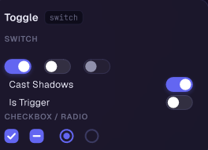

```csharp
Origami.Toggle(paper, "notify", enabled, v => enabled = v)
    .Label("Enable notifications")
    .Show();
```

- `AsSwitch()` (default), `AsCheckbox()`, `AsRadio()` -- or use the shortcut factories `Origami.Switch`, `Origami.Checkbox`, `Origami.Radio`
- `Label(...)`, `LabelLeft(...)`, `Description(...)` for a settings-row subtitle
- `Small()`, `Medium()`, `Large()`, `Indeterminate(...)` (checkbox tri-state)
- `OnText(...)` / `OffText(...)` / `OnGlyph(...)` / `OffGlyph(...)` (switch only)
- `Error(...)`, `HelperText(...)`, `Disabled(...)`, `ReadOnly(...)`

## RadioGroup

A single-select group of radios bound to a typed list of items.


```csharp
Origami.RadioGroup(paper, "align", currentAlign, v => currentAlign = v, alignOptions)
    .Display(a => a.ToString())
    .Show();
```

- `Vertical()` (default) / `Horizontal()`
- `Display(...)`, `Description(...)`, `IsItemEnabled(...)`, `Comparer(...)`
- `Origami.EnumRadioGroup<TEnum>(...)` renders every enum value as a row automatically

## Slider

A single-thumb track for picking a numeric value in a range. Generic over any `INumber<T>`.

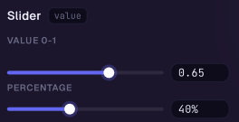

```csharp
Origami.Slider(paper, "volume", volume, v => volume = v, 0f, 1f)
    .Show();
```

- `Range(min, max)`, `Step(...)`, `Logarithmic(...)`, `Bipolar(...)`
- `ShowValue(...)` toggles the inline numeric field, `ShowTooltip(...)` the drag-value bubble
- `Ticks(count)`, `TickLabels(...)`, `Vertical(...)`
- `Small()`, `Medium()`, `Large()`, `WheelStep(...)`, `KeyboardStep(...)`

Notes: `Origami.IntSlider(...)` is the int convenience; `SliderInternal` holds the shared value<->track math and is not called directly.

## RangeSlider

A two-thumb slider for picking a low/high pair within an outer range.

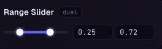

```csharp
Origami.RangeSlider(paper, "price-range", low, high, (lo, hi) => { low = lo; high = hi; }, 0f, 500f)
    .Show();
```

- `AllowSwap(...)` -- whether dragging one thumb past the other swaps their roles (default) or clamps
- `MinDistance(...)`, `Step(...)`, `Ticks(...)`, `ShowValue(...)`
- Mirrors most of `Slider`'s sizing and display modifiers

## NumericField

A text field constrained to numbers, generic over any `INumber<T>` (float, int, decimal, etc). Accepts small math expressions like `"2*3+1"` or `"pi*2"`.

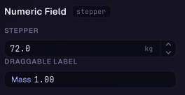

```csharp
Origami.NumericField(paper, "radius", radius, v => radius = v)
    .Min(0f).Max(100f)
    .Show();
```

- `Min(...)`, `Max(...)`, `Step(...)`, `Format(...)` (e.g. `"F2"`), `Culture(...)`
- `Prefix(text, color)` for a channel badge, `Suffix(...)` for a unit label
- `Stepper(...)` for up/down buttons, `DraggableLabel(...)` to make the prefix a scrub handle
- `Validator(...)`, `Error(...)`, `HelperText(...)`

## VectorField

A row of 2, 3, or 4 colored NumericFields (X/Y/Z/W) for editing a vector as one unit.

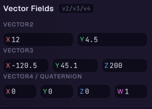

```csharp
Origami.Float3Field(paper, "position", position, v => position = v).Show();
```

- Factories: `Float2Field`/`Float3Field`/`Float4Field`, `Double2Field`/`Double3Field`/`Double4Field`, `Int2Field`/`Int3Field`/`Int4Field`
- `Height(...)` sets the row height for every cell

Notes: each axis is a draggable-label NumericField, so dragging the "X"/"Y"/"Z" tag scrubs the value the same way a game-engine inspector field does.

## TextField

A single or multi-line text input with slots for icons, prefixes/suffixes, and autocomplete.

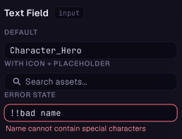

```csharp
Origami.TextField(paper, "name", name, v => name = v)
    .Placeholder("Enter a name")
    .Show();
```

- `Search(...)`, `Password(...)`, `MultiLine(rows)` -- or the shortcut factories `Origami.SearchField`, `Origami.PasswordField`, `Origami.TextArea`
- `LeadingIcon(...)`, `TrailingIcon(...)`, `ClearButton(...)`, `Prefix(...)`, `Suffix(...)`, `Mono(...)`
- `AutoComplete(items, onPick?, max?)` with an optional custom `AutoCompleteFilter(...)`
- `CharFilter(...)` or the built-ins `IntFilter()`, `FloatFilter()`, `AlphaNumeric()`, `NoSpaces()`
- `Validator(...)`, `Error(...)`, `HelperText(...)`, `SubmitOnEnter(...)`

## ColorField

A swatch that opens a full HSV/RGB/Hex color picker popover, with an optional saved palette.

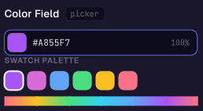

```csharp
Origami.ColorField(paper, "tint", tint, v => tint = v)
    .Show();
```

- `Alpha(bool)` to show/hide the alpha bar, `HDR(bool)` to allow channel values above 1.0
- `Palette(ColorPalette)` attaches a caller-owned swatch list to the popover (click to pick, right-click to remove, `+` to add)
- `ReadOnly()`, `Width(...)`, `Height(...)`

## DatePicker

A field that opens a calendar (and optional time) popover, or can be embedded inline.

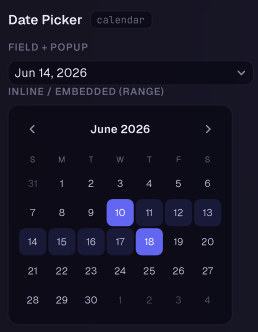

```csharp
Origami.DatePicker(paper, "due-date", dueDate, v => dueDate = v)
    .DateOnly()
    .Show();
```

- `Mode(...)` / `DateOnly()`, `TimeOnly()`, `DateTime()`
- `Use24Hour(...)`, `Format(...)`, `DisabledDates(predicate)`
- `Range(rangeEnd, rangeEndSetter)` for two-click date-range picking
- `Inline(width)` renders the calendar embedded in the layout instead of behind a popover trigger

## Dropdown

A single-select popover list bound to a typed item collection.

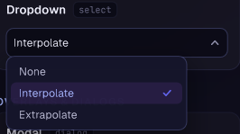

```csharp
Origami.Dropdown(paper, "country", selectedCountry, v => selectedCountry = v, countries)
    .Display(c => c.Name)
    .Show();
```

- `Display(...)`, `Icon(...)`, `Secondary(...)`, `IsItemEnabled(...)`, `Comparer(...)`
- `Searchable(placeholder?)` with an optional `SearchFilter(...)`
- `PageSize(...)` for pagination, `MaxHeight(...)`, `PopoverWidth(...)`
- `Inline(label)` renders an inspector-style "Label ... value" row with no chevron
- Convenience factories: `Origami.Dropdown(paper, id, index, setter, stringOptions)` for string arrays, `Origami.EnumDropdown<TEnum>(...)` for enums

## MultiDropdown

Like `Dropdown`, but each row carries a checkbox and the setter receives the full selection set on every toggle.

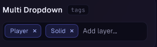

```csharp
Origami.MultiDropdown(paper, "tags", selectedTags, v => selectedTags = v, allTags)
    .Display(t => t.Name)
    .Show();
```

- Same rendering/search/pagination modifiers as `Dropdown`
- `SummaryItemLimit(...)` controls how many picked names show in the trigger before it falls back to a count summary
- `Origami.FlagsDropdown<TEnum>(...)` adapts a `[Flags]` enum into a multi-select automatically
