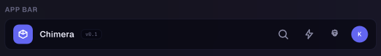
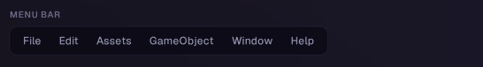
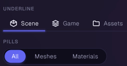
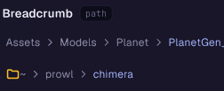
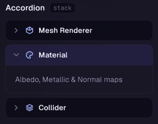
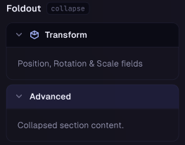
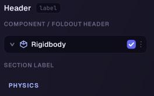
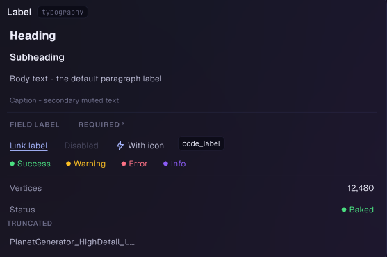
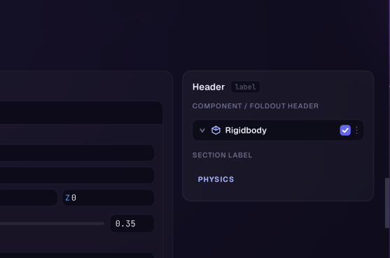
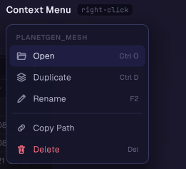

# Layout & Navigation

Widgets for structuring and navigating a screen: bars, tabs, breadcrumbs, collapsible sections, scrolling, and popup menus.

## AppBar

A glass pill holding a brand mark, tags, a flexible spacer, icon action buttons and an avatar, laid out left-to-right in the order added.



```csharp
Origami.AppBar(paper, "topbar")
    .Brand(myLogoIcon, "Nebula")
    .Tag("v0.1")
    .Spacer()
    .Action("settings", OrigamiIconSet.Gear, () => OpenSettings())
    .Avatar("me", "KA")
    .Show();
```

- `Brand(icon, title)` - logo tile + title, first item
- `Tag(text)` - small mono pill (e.g. a version string)
- `Spacer()` - pushes everything after it to the right
- `Action(id, icon, onClick)` - square icon button
- `Avatar(id, text, color?)` - circular initials badge
- `Height(float)` - default 44

## MenuBar

A horizontal strip of top-level menu buttons (File, Edit, ...), each opening a dropdown built with the `ContextBuilder` API.



```csharp
Origami.MenuBar(paper, "mainmenu")
    .Menu("File", m => m
        .Item("New", () => New(), shortcut: "Ctrl N")
        .Item("Open...", () => Open())
        .Separator()
        .Item("Exit", () => Quit()))
    .Menu("Edit", m => m
        .Item("Undo", () => Undo(), shortcut: "Ctrl Z"))
    .Show();
```

- `Menu(label, build)` - one per top-level entry; `build` uses the same `ContextBuilder` API as context menus (items, submenus, separators, toggles, shortcuts)
- `Height(float)` - default 32
- `Transparent(bool)` - draw as floating text with no glass fill/border

Notes: click opens a menu; while one is open, hovering another top-level button switches to it; clicking away closes it.

## Tabs

A controlled horizontal tab strip - the caller owns the selected index and Origami calls the setter on change.



```csharp
Origami.Tabs(paper, "views", selectedIndex, i => selectedIndex = i)
    .Tab("Scene")
    .Tab("Game")
    .Tab("Assets", badge: "3")
    .Show();
```

- `Underline()` / `Pills()` - visual style (default Underline)
- `Tab(label)` / `Tab(label, icon)` / `GlyphTab(label, glyph, badge?)`
- `Closeable(onClose)` - adds a close (x) affordance per tab
- `OnTabPress(onPress)` - fires on pointer-down, useful for drag-out-to-float in docking hosts
- `Variant(...)`, `Height(float)`, `Width(UnitValue)`

## Breadcrumb

A navigation trail of clickable segments with a configurable separator.



```csharp
var items = new[] { new BreadcrumbItem("Project"), new BreadcrumbItem("Assets"), new BreadcrumbItem("Textures") };
Origami.Breadcrumb(paper, "path", items, item => Navigate(item))
    .Show();
```

- `Separator(...)` or shorthands `Chevrons()`, `Slashes()`, `Dots()`, `Arrows()`, `CustomSeparator(string)`, `NoSeparator()`
- `ShowIcons(bool)`, `HighlightLast(bool)`, `TruncateFirst(bool)` - icon-only first segment (e.g. a home root)
- `ActiveIndex(int)` - explicitly mark a segment active instead of defaulting to the last one
- `Variant(...)` - color of the active segment

## Accordion

A single-open group of collapsible sections; each section is an Origami `Foldout` under the hood.



```csharp
Origami.Accordion(paper, "settings")
    .Section("general", "General", () => DrawGeneralSettings())
    .Section("advanced", "Advanced", () => DrawAdvancedSettings())
    .Show();
```

- `Section(id, title, body)` / `Section(id, title, icon, body)`
- `DefaultOpen(id)` - which section starts open
- `AllowAllClosed(bool)` - when false, clicking the open section keeps it open (one section is always expanded)
- `Spacing(float)` - vertical gap between sections

Notes: open state is tracked internally, keyed by section id - the caller holds no state.

## Foldout

A single collapsible panel: header row (chevron, label, optional icon/toggle/badge) plus a body that expands/collapses with an animated height.



```csharp
Origami.Foldout(paper, "stats", "Stats")
    .DefaultExpanded(true)
    .Body(() => {
        Origami.Label(paper, "fps", "60 fps").Show();
    });
```

- `DefaultExpanded(bool)` - first-render state; after that, expand state persists per-instance
- `Expanded(value, onChanged)` - controlled mode, used by `Accordion` for single-open groups
- `Toggle(value, setter)` - adds an enable checkbox next to the chevron
- `Badge(text)`, `Icon(IOrigamiIcon)`, `Variant(...)`
- `HeaderBackground(color)`, `BodyBackground(color)`, `BodyOutlined(bool)`, `Rounding(float)`

## Header

A section divider / label row with several visual styles, from a plain uppercase label to a full foldout-style component row.



```csharp
Origami.Header(paper, "sec1", "Transform").Line().Show();

Origami.Separator(paper, "sep1").Show();
```

- `Style(HeaderStyle)` or shorthands `Text()`, `Line()`, `LineCentered()`, `Box()`, `Separator()`, `Underline()`, `Component()`
- `Icon(...)`, `Badge(text)`, `Variant(...)`
- `Component()` style adds `Chevron(expanded)`, `Checkbox(on)`, `More(bool)`, `OnClick(...)` for a clickable foldout-style row
- `Origami.Separator(paper, id)` is sugar for a text-less `Header` with `Style.Separator`

## Label

A general-purpose text primitive with variant coloring, icons, truncation, and a set of decoration presets (heading, caption, code, link, etc).



```csharp
Origami.Label(paper, "title", "Inspector").Heading().Show();

Origami.Label(paper, "hint", "Read-only").Caption().Show();
```

- Presets: `Heading()`, `Subheading()`, `Body()`, `Caption()`, `Muted()`, `FieldLabel()`, `Link()`, `Code()`
- `Size(LabelSize)` (XS/SM/MD/LG/XL), `Align(...)`, `VAlign(...)`, `Truncate(Ellipsis/Clip)`
- `LeadingIcon(...)`, `TrailingIcon(...)`, `Dot(color?)` - small leading semantic dot
- `Background(...)`, `Pill(...)`, `Border(...)`, `Underline(...)`, `Strikethrough(...)`, `Shadow(...)`, `Inset(...)`
- `Tooltip(text)`, `OnClick(...)`, `Disabled(bool)`

## ScrollView

A clipped, scrollable viewport (vertical and/or horizontal) with draggable scrollbar thumbs.



```csharp
Origami.ScrollView(paper, "log", width: 300, height: 400)
    .Body(() => {
        foreach (var line in logLines)
            Origami.Label(paper, line.Id, line.Text).Show();
    });
```

- `Vertical(bool)` (default true), `Horizontal(bool)` (default false)
- `Padding(...)`, `ColSpacing(float)` - spacing between stacked children
- `ForceScrollbar(bool)`, `ScrollbarSize(float)`, `AutoHideScrollbars(bool)`
- `SmoothScroll(bool)` - turn off for virtualized lists (see Notes)
- `Body(Action<ScrollViewport>)` overload hands back scroll offset + visible size, for virtualizing long content
- `Origami.ScrollTo(id, offset)` - request a scroll offset from outside, applied on the view's next render

Notes: when virtualizing (rendering only visible rows), turn `SmoothScroll` off - easing the content toward a target offset while the visible window is computed from that same target would leave rows mismatched mid-animation.

## ContextMenu

Popup menus built with the shared `ContextBuilder` API (items, headers, toggles, separators, submenus). Two entry points: open programmatically at a position, or attach to an element's right-click.



```csharp
// Open at an arbitrary screen position (e.g. from a button's OnClick):
Origami.ContextMenu(x, y, m => m
    .Item("Rename", () => Rename())
    .Item("Delete", () => Delete(), danger: true));

// Attach a right-click menu to the current element:
using (paper.Box("row").Enter())
{
    Origami.RightClickMenu(paper, "row", m => m
        .Header("Actions")
        .Item("Copy", () => Copy())
        .Toggle("Pinned", () => TogglePin(), () => isPinned)
        .Submenu("Sort By", sm => sm.Item("Name", () => {}).Item("Date", () => {})));
}
```

- `ContextBuilder.Item(label, onClick, enabled?, icon?, shortcut?, danger?, on?, iconDraw?)`
- `ContextBuilder.Header(text)` - non-interactive section header
- `ContextBuilder.Title(text, icon?)` - prominent title row with a divider beneath
- `ContextBuilder.Toggle(label, onClick, getValue, enabled?)`
- `ContextBuilder.Separator()`, `ContextBuilder.Submenu(label, build, icon?)`

Notes: only one context menu is open at a time; `Origami.ContextMenu` closes any existing one before opening.
