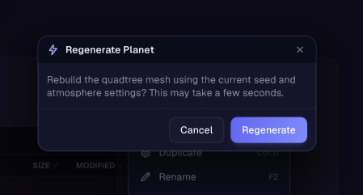
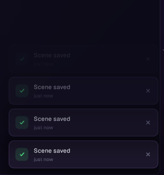
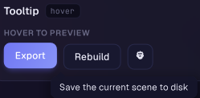
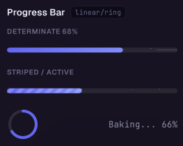
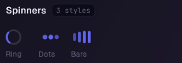
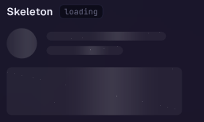
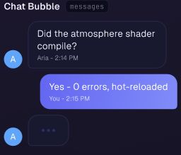
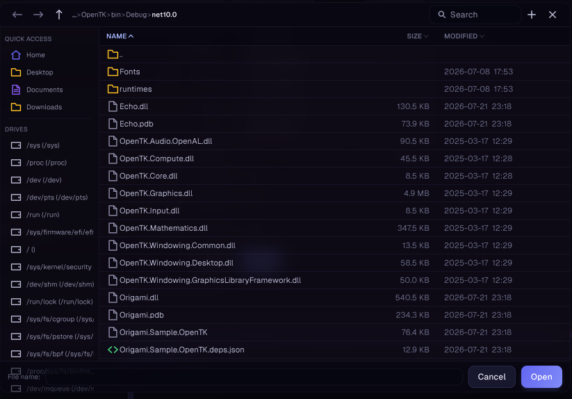

# Overlays & Feedback

Widgets in this category render above the normal layout flow (modals, toasts, tooltips) or
communicate transient state (progress, loading, chat). Modals, toasts, and tooltips are queued
by the caller and drawn later by the shared overlay systems, so `Origami.EndFrame(paper)` must
run once per frame after all other widgets, or nothing will appear on screen.

## Modal

A stacked dialog with a title bar, body content, and footer buttons. Supports confirm/message
shortcuts, fully custom content, and stacking multiple modals with progressively darker backdrops.



```csharp
Origami.Modal("Delete Item?")
    .Message("This action cannot be undone.")
    .Button("Cancel", () => { })
    .DangerButton("Delete", DeleteItem)
    .Show();

Origami.Confirm("Discard changes?", "You have unsaved edits.", onYes: DiscardChanges);
Origami.Message("Saved", "Your changes have been saved.");
```

- `.Content(draw)` for a fully custom body instead of `.Message(text)`
- `.Icon(icon)` for a leading vector icon in the title bar
- `.Width(px)` / `.Height(px)` (height 0 = auto-size to content)
- `.CloseOnBackdrop()` / `.CloseOnEscape(false)` to change dismiss behavior
- `Origami.Dialog(title, drawContent, width, height)` returns a `DialogModal` for adding buttons afterward
- `Origami.PushModal(draw, closeOnEscape, closeOnBackdrop)` for a fully custom modal with caller-controlled rendering (e.g. file browsers)

Notes: modals stack — pushing one while another is open layers it on top with a darker backdrop.
Some modal types support `ShowEmbedded` to render the same chrome inline in normal layout flow
(no backdrop, no stack) for previews or embedded panels.

## Toasts

Transient notification cards that stack in the bottom-right corner and auto-dismiss.



```csharp
Origami.Toast("Upload complete")
    .Message("report.pdf uploaded successfully.")
    .Success()
    .Show();
```

- `.Info()` / `.Success()` / `.Warning()` / `.Error()` set both the accent color and icon (Error defaults to a 5s duration)
- `.Duration(seconds)` overrides the default 3s display time
- Static shortcuts: `Toasts.Success(title, message)`, `Toasts.Error(title, message)`, etc.

## Tooltip

A hover tooltip with a short show-delay, smart clamping to the screen, and optional rich content
(title, icon, keyboard shortcut hint).



```csharp
Origami.Button(paper, "save_btn", "Save", Save)
    .Show();

paper.Box("thumb").Tooltip("Rename", "Press F2 to rename this item");
```

- Simplest form: `.Tooltip(text)` or `.Tooltip(title, description)` as an extension on any element builder
- `Origami.ShowTooltip(elementId, text)` / `Origami.ShowTooltip(elementId, TooltipContent)` for manual hover reporting from custom hover handlers
- `TooltipContent` also supports `Icon`, `Shortcut`, `MaxWidth`, and a `CustomDraw` callback for fully custom bodies
- Most built-in widgets (e.g. `Button.Tooltip(text)`) wire this up for you already

Notes: only one tooltip is shown at a time, and it waits `TooltipSystem.ShowDelay` seconds
(default 0.5) of continuous hover on the same element before appearing.

## ProgressBar

A linear or circular progress indicator, determinate (0 to 1) or indeterminate (sliding band).



```csharp
Origami.ProgressBar(paper, "upload_progress", uploadFraction)
    .Label("Uploading")
    .ShowPercent()
    .Show();

Origami.ProgressBar(paper, "loading", 0f)
    .Indeterminate()
    .Show();
```

- `.Ring()` / `.Circular()` for a circular gauge instead of a linear track
- `.Thin()` for a slim 4px track, or `.Size(ProgressSize.LG)` for a size preset
- `.Striped()` for animated diagonal stripes, `.Glow()` for a soft leading-edge glow
- `.TrailingText(text)` for custom trailing text instead of a percentage

## Spinner

An animated loading indicator with several built-in styles.



```csharp
Origami.Spinner(paper, "loading_spinner")
    .Arc()
    .MD()
    .Label("Loading...")
    .Show();
```

- Styles: `.Arc()`, `.Dots()`, `.Pulse()`, `.DualArc()`, `.Bars()`, `.Ring()`
- Sizes: `.XS()` through `.XL()`, or `.Diameter(px)` for an exact size
- `.Tint(color)` overrides the variant color; `.Speed(multiplier)` scales animation speed

## Skeleton

A neutral placeholder shape with a shimmer sweep, used while real content loads.



```csharp
Origami.Skeleton(paper, "name_placeholder")
    .TextLine(140)
    .Show();

Origami.Skeleton(paper, "avatar_placeholder")
    .Avatar(32)
    .Show();
```

- `.Rect()` / `.Pill()` / `.Circle()` for the base shape, or the `.TextLine(width)` / `.Avatar(diameter)` shortcuts
- `.Size(width, height)` for exact dimensions
- `.Shimmer(false)` to disable the animated sweep; `.ShimmerSpeed(multiplier)` to adjust its pace

## ChatBubble

A speech-bubble container with an optional avatar, header, footer, and a caller-provided content
body, suited to chat/assistant-style UIs.



```csharp
Origami.ChatBubble(paper, "msg_1", p =>
        Origami.Label(p, "msg_1_text", "Hey, how's the build looking?").Show())
    .Avatar("MK", System.Drawing.Color.SlateBlue)
    .Header("Mike")
    .TailLeft()
    .Show();
```

- `.TailLeft()` / `.TailRight()` / `.TailTop()` / `.TailBottom()` / `.NoTail()` control which corner reads as the speech tail
- `.Avatar(texture, size)` or `.Avatar(initials, color, size)` for a leading/trailing avatar
- `.Primary()` / `.Success()` / etc. give the bubble an accent-gradient "my message" look; the default variant renders a neutral "their message" surface
- `.MaxWidth(px)` caps bubble width before content wraps

## FileDialog

A file/folder browser, either as a floating modal or embedded inline in normal layout flow. The
caller supplies favorites, recent files, and icon resolution via `FileDialogConfig`; Origami owns
navigation, sorting, search, and inline rename/new-folder.



```csharp
Origami.OpenFileDialog(FileDialogMode.Open, path =>
{
    if (path != null) LoadProject(path);
});
```

- `FileDialogMode.Open` / `.Save` / `.SelectFolder` select the interaction mode
- `startPath`, `filters`, `filterLabels` narrow the initial location and visible file types
- `FileDialog.DrawEmbedded(paper, id, width, height, startPath, config)` renders the same browser inline instead of as a floating modal
- `FileDialogConfig` supplies `QuickAccess`, `Favorites`, `RecentFiles`, `GetIcon`, and `GetDrives` hooks

Notes: only one floating file dialog can be open at a time; embedded browsers keep independent
per-id state and can coexist with it.
